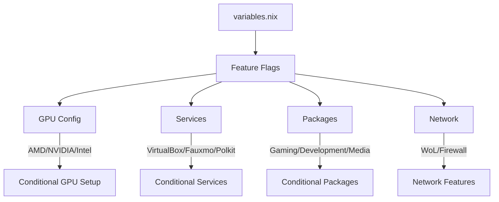
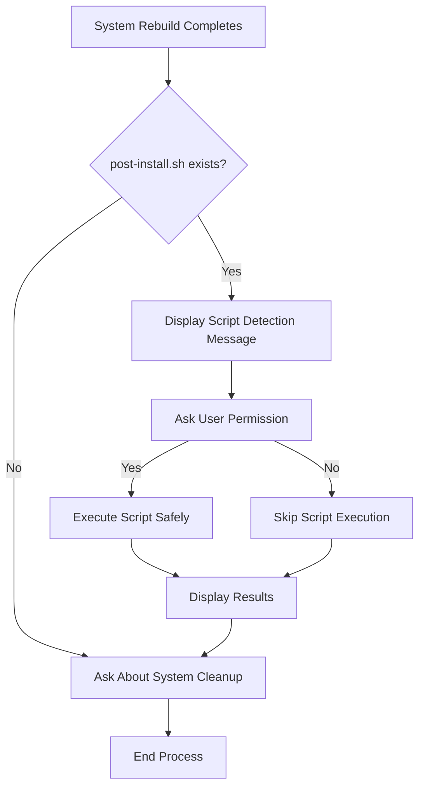

# 📚 NixOS Configuration Guide


> Complete guide to understand and customize this NixOS configuration with Feature Flags

## 📑 Table of Contents

1. [Installation](#-installation)
2. [How the System Works](#-how-the-system-works)
3. [File Structure](#-file-structure)
4. [Feature Flags System](#-feature-flags-system)
5. [Installed Packages](#-installed-packages)
6. [Configuration Examples](#-configuration-examples)
7. [Post-Installation Scripts](#-post-installation-scripts)
8. [Essential Commands](#-essential-commands)
9. [Advanced Customization](#-advanced-customization)

## 🚀 Installation

### **Quick Installation**

```bash
# Clone the repository
git clone https://github.com/JakeMartinezz/hyprland-nix.git ~/nixos
cd ~/nixos

# Make the installer executable and run it
chmod +x install.sh
./install.sh
```

### **🔧 Installation Script Features**

The intelligent installer (`install.sh`) provides a comprehensive interactive setup experience:

#### **📊 Interactive Configuration Collection**
- **Step-by-step Setup**: Guided configuration process with validation
- **Hardware Detection**: Automatic detection of system components
- **Service Selection**: Choose which services to enable (VirtualBox, Alexa integration, etc.)
- **Package Categories**: Select gaming, development, media, and desktop packages
- **Rollback Generations**: Configure how many system generations to keep (default: 2)
- **Security Checks**: Prevents common installation errors with pre-flight validation
- **Real-time Validation**: Input validation with helpful error messages

#### **🎮 Smart GPU Detection**
- **Automatic Detection**: Identifies AMD, NVIDIA, and Intel GPUs
- **Driver Recommendations**: Suggests appropriate drivers for each GPU type
- **Performance Settings**: Configures optimal settings for gaming and productivity
- **Multi-GPU Support**: Handles hybrid graphics configurations

#### **💾 Dynamic Disk Management**
```bash
Additional disks/partitions detected:

  [1] /dev/sdb1
      Size: 931.5G
      Filesystem: ext4
      UUID: 12345678-abcd-4def-9012-3456789abcde
      Label: External

# Automatically suggests mount point: /mnt/external
```

- **Auto-Detection**: Scans for additional disks and partitions
- **Label-Based Mounting**: Suggests mount points based on disk labels
- **UUID Extraction**: Automatically extracts UUIDs for stable mounting
- **Mount Options**: Customizable options with intelligent defaults (`defaults,x-gvfs-show`)

#### **📋 Configuration Presets System**
```bash
📁 Saved configuration found!

Configuration Details:
  Username: jake
  Hostname: martinez
  GPU Type: amd
  Laptop: false
  Bluetooth: false
  Gaming: true
  Development: true
  Media: true
  VirtualBox: true
  Fauxmo/Alexa: true
  Kanshi (Display Management): true
  Rollback Generations: 2
  Auto Updates: true
  GTK Theme: gruvbox
  Icon Theme: gruvbox-plus-icons
  Additional Disks: 1 configured
    • External Disk: /mnt/external (ext4, 931.5G)
  Created: Wed Jul 23 14:32:45 -03 2025

Use this configuration? (Y/n):
```

- **Save Complete Configurations**: Store all settings with Base64 encoding
- **Quick Reinstallation**: Skip configuration process with saved presets
- **Portable Presets**: Saved in `preset.conf` file for easy transfer
- **Detailed Information**: Shows creation date and complete configuration details

#### **🌐 Multilingual Support**
- **English/Portuguese**: Complete interface translation
- **Cultural Defaults**: Appropriate defaults based on language selection
- **Localized Messages**: All prompts and error messages respect language choice
- **Smart Detection**: Automatically detects system locale for default language

#### **🔒 Installation Safety Features**

1. **Pre-Installation Validation**
   - System requirements check (RAM, disk space, architecture)
   - Dependency verification (required tools and packages)
   - Permission validation (sudo access, write permissions)
   - Security environment checks (container detection, UEFI/BIOS, Secure Boot)
   - Internet connectivity verification (NixOS cache, GitHub access)
   - Input validation (username/hostname format checking)

2. **Configuration Preview**
   ```bash
   ╔════════════════ CONFIGURATION PREVIEW ════════════════╗
   ║ Username: jake                                         ║
   ║ Hostname: martinez                                     ║
   ║ GPU: AMD (drivers will be installed)                   ║
   ║ Services: VirtualBox, Fauxmo/Alexa                     ║
   ║ Packages: Gaming, Development, Media                   ║
   ║ Additional Disks: 1 disk configured                    ║
   ╚══════════════════════════════════════════════════════╝
   
   Proceed with installation? (Y/n):
   ```

3. **Safe File Handling**
   - Optional backup of existing NixOS configuration
   - Selective file copying (excludes documentation, preserves hardware-configuration.nix)
   - Rollback capability if installation fails

### **💡 Installation Process Flow**

1. **🔍 System Detection**
   - Hardware component identification
   - System architecture and capabilities check
   - Existing configuration analysis

2. **⚙️ Interactive Setup**
   - User information collection (username, hostname)
   - GPU type selection with automatic detection
   - Feature enablement/disablement (laptop mode, Bluetooth, etc.)
   - Service configuration (VirtualBox, Alexa integration, etc.)
   - Rollback generations configuration (system stability management)
   - Auto-update settings (weekly system updates)

3. **💾 Disk Configuration**
   - Additional disk detection and analysis
   - Mount point configuration with label-based suggestions
   - Filesystem options and mount parameters setup
   - UUID-based stable mounting configuration

4. **📋 Configuration Preview**
   - Complete setup review before installation
   - Validation of all selected options
   - Confirmation prompt with detailed summary

5. **🚀 Safe Deployment**
   - Optional backup of existing configuration
   - Selective file copying to `/etc/nixos`
   - Configuration file generation with user settings
   - Post-installation rebuild option

6. **🔧 Post-Installation Automation**
   - Optional execution of user-defined scripts
   - Automatic detection of `post-install.sh` in project root
   - User permission required for script execution
   - Safe error handling and cleanup integration

### **🔧 Advanced Installation Options**

#### **Dotfiles Integration**
- **Optional Setup**: Choose to download and configure dotfiles
- **GNU Stow Integration**: Automatic symlink management
- **Repository Selection**: Support for custom dotfiles repositories
- **Conflict Resolution**: Handle existing dotfiles gracefully

#### **Custom Repository URLs**
- **Source Flexibility**: Use forks or custom repositories
- **Branch Selection**: Choose specific branches for installation
- **Local Installation**: Support for local repository copies

#### **Preset Management**
```bash
# Save current configuration as preset
./install.sh --save-preset "my-gaming-setup"

# Load and use specific preset
./install.sh --load-preset "my-gaming-setup"

# List available presets
./install.sh --list-presets
```

### **🚨 Installation Troubleshooting**

#### **Common Issues**
- **Permission Errors**: Ensure script has execute permissions (`chmod +x install.sh`)
- **Disk Detection Issues**: Run with sudo if additional disks aren't detected
- **Network Problems**: Check internet connection for package downloads
- **Space Requirements**: Ensure at least 2GB free space in `/nix/store`

#### **Recovery Options**
- **Rollback**: Use `nixos-rebuild --rollback` if rebuild fails (2 generations kept by default)
- **Boot Menu Recovery**: Select older generations from systemd-boot menu
- **Manual Configuration**: Edit `/etc/nixos/config/variables.nix` directly if needed
- **Hardware Reset**: Regenerate `hardware-configuration.nix` with `nixos-generate-config`
- **Generation Management**: View with `nixos-rebuild list-generations`

## 🔧 How the System Works

### **Core Philosophy: Feature Flags**

This NixOS configuration uses a system of **centralized feature flags** that allows a single universal configuration adaptable to any hardware through boolean flags in `variables.nix`.



### **Loading Flow**

1. **flake.nix** loads `variables.nix` as source of truth
2. **Overlays** are applied universally (zen-browser, pokemon-colorscripts)
3. **Modules** are imported conditionally based on features
4. **Configurations** are applied only when necessary

## 🏗️ File Structure

### **Organization by Responsibility**

```
nixos/
├── config/
│   └── variables.nix              🎯 CENTRAL CONFIGURATION
├── lib/
│   └── fauxmo.nix                 📱 REUSABLE COMPONENTS
├── modules/
│   ├── home/                      👤 USER
│   │   ├── custom-scripts.nix     🔧 Scripts (rebuild/clean/update)
│   │   ├── git.nix                📝 Git configuration
│   │   ├── gtk.nix                🎨 GTK themes
│   │   ├── hypr-workspace-manager.nix 🖥️ Monitor-based service management
│   │   ├── kanshi.nix             📺 Display/monitor configuration
│   │   └── zsh.nix                💻 Custom shell
│   ├── packages/
│   │   ├── home/                  📦 USER PACKAGES
│   │   │   ├── core.nix           🔧 Essential tools
│   │   │   ├── development.nix    💻 Development environment
│   │   │   ├── gaming.nix         🎮 Gaming applications
│   │   │   ├── media.nix          🎵 Media and communication
│   │   │   └── desktop.nix        🖥️ GUI applications
│   │   └── system/                📦 SYSTEM PACKAGES
│   │       ├── core.nix           🔧 Fundamental tools
│   │       ├── desktop.nix        🖥️ Desktop environment
│   │       ├── gaming.nix         🎮 Gaming components
│   │       ├── media.nix          🎵 Media components
│   │       └── docker.nix         🐳 Docker containerization
│   └── system/                    ⚙️ SYSTEM
│       ├── auto-update.nix        ⚙️ Automatic system updates
│       ├── bluetooth.nix          🟦 Bluetooth configuration
│       ├── boot.nix               🚀 Boot (XanMod, optimized)
│       ├── conditional-services.nix 🔄 Conditional services
│       ├── docker.nix             🐳 Docker containerization
│       ├── filesystems.nix        💾 Disks and mounting
│       ├── fonts.nix              🔤 System fonts
│       ├── gpu.nix                🎨 GPU (AMD/NVIDIA)
│       ├── pipewire.nix           🔊 PipeWire audio
│       ├── services.nix           🛠️ Services (GDM, power)
│       └── tz-locale.nix          🌍 Timezone/localization
├── flake.nix                      🌟 ENTRY POINT
├── configuration.nix              ⚙️ MAIN CONFIG
├── home.nix                       🏠 HOME MANAGER
└── hardware-configuration.nix     🔧 HARDWARE (auto)
```

## 🎛️ Feature Flags System

### **variables.nix Structure**

```nix
{
  # === BASIC INFORMATION ===
  username = "jake";
  hostname = "martinez";
  
  # === FEATURE FLAGS ===
  features = {
    # GPU Configuration
    gpu = {
      type = "amd";          # "amd" | "nvidia" | "intel"
      amd = {
        enable = true;
        optimizations = {    # Environment variables
          RADV_PERFTEST = "aco";
          MESA_GL_THREAD = "true";
        };
      };
      nvidia = {
        enable = false;
        prime = {
          enable = false;
          sync = true;
          intelBusId = "PCI:0:2:0";
          nvidiaBusId = "PCI:1:0:0";
        };
        optimizations = {
          WLR_NO_HARDWARE_CURSORS = "1";
          NIXOS_OZONE_WL = "1";
          GBM_BACKEND = "nvidia-drm";
          __GLX_VENDOR_LIBRARY_NAME = "nvidia";
        };
      };
    };
    
    # Hardware Features
    bluetooth = {
      enable = false;        # Desktop usually doesn't need
      powerOnBoot = false;
      packages = [ "bluez" "bluez-tools" "blueman" ];
    };
    
    laptop = {
      enable = false;        # Desktop mode
      packages = [ "wpa_supplicant" "hyprlock" ];
    };
    
    # Services and Integrations
    services = {
      fauxmo = {
        enable = true;       # Alexa integration
        ports = [ 52002 ];   # Firewall ports
      };
      
      virtualbox = {
        enable = true;       # VM support
      };
      
      docker = {
        enable = true;       # Docker containerization
        portainer = {
          enable = true;     # Docker web management UI
        };
      };
      
      polkit_gnome = {
        enable = true;       # GUI authentication
      };
    };
    
    # Network Features
    network = {
      wakeOnLan = {
        enable = true;
        interface = "enp6s0"; # Network interface
      };
    };
  };
  
  # === PATHS AND CONFIGURATIONS ===
  paths = {
    configPath = "/etc/nixos";
    backupBasePath = "/mnt/discos/utilitário/nix";
    backupConfigPath = "/mnt/discos/utilitário/nix/nixos/";
  };
  
  # === FILESYSTEMS ===
  filesystems = {
    diskUUID = "7e119fb3-fb23-48b2-8e71-ee0d53691ecf";
    mountPoint = "/mnt/discos";
    fsType = "ext4";
    mountOptions = [ "defaults,x-gvfs-show" ];
  };
  
  # === BUILD AND PERFORMANCE ===
  build = {
    maxJobs = "auto";      # Auto-detect
    cores = 0;             # Use all cores (0 = auto)
    
    # Cache settings
    keepOutputs = true;
    keepDerivations = true;
    autoOptimiseStore = true;
    
    # System generations
    rollbackGenerations = 2;
  };
  
  # === SYSTEM SERVICES ===
  services = {
    # Garbage collection
    gc = {
      automatic = true;
      dates = "weekly";
      options = "--delete-older-than 7d";
    };
  };
}
```

## 📦 Installed Packages

### **System vs Home Separation**

#### **System Packages** (`environment.systemPackages`)
```nix
# modules/packages/system/core.nix
- wget, git, python3          # Fundamental tools
- pciutils, stow              # System utilities
- gnome-system-monitor        # Monitoring
- polkit_gnome [conditional]  # GUI authentication

# modules/packages/system/desktop.nix
- hyprland, nautilus          # Desktop environment
- firefox, alacritty          # Basic applications

# modules/packages/system/gaming.nix [conditional]
- steam, gamemode             # Essential gaming
- wine, lutris                # Compatibility

# modules/packages/system/media.nix [conditional]
- pipewire, wireplumber       # System audio
- ffmpeg, gstreamer          # Codecs

# modules/system/docker.nix [conditional]
- docker, docker-compose      # Containerization
- docker-buildx               # Multi-platform builds
```

#### **Home Packages** (`home.packages`)
```nix
# modules/packages/home/core.nix
- htop, tree, unzip          # User utilities
- claude-code, cursor        # Development tools

# modules/packages/home/development.nix [conditional]
- vscode, yarn, nodejs       # Web development
- docker-compose, kubectl    # DevOps
- postman, bruno             # API testing

# modules/packages/home/gaming.nix [conditional]
- discord, obs-studio        # Gaming community
- mangohud, goverlay         # Gaming monitoring

# modules/packages/home/media.nix [conditional]
- spotify, vlc               # Media playback
- gimp, kdenlive            # Editing
- youtube-dl, yt-dlp        # Media download

# modules/packages/home/desktop.nix [conditional]
- telegram-desktop           # Communication
- libreoffice               # Productivity
- flameshot                 # Screenshots
```

### **Available Overlays**
```nix
# flake.nix - Centralized overlays
- zen-browser               # Optimized browser
- pokemon-colorscripts      # Colorful terminal
- ags                      # Widget system
```

## 💡 Configuration Examples

### **Scenario 1: AMD Gaming Desktop**
```nix
# variables.nix
{
  features = {
    gpu = {
      type = "amd";
      amd.enable = true;
    };
    laptop.enable = false;
    bluetooth.enable = false;
    
    services = {
      virtualbox.enable = true;
      fauxmo.enable = true;
      docker.enable = true;
      polkit_gnome.enable = true;
    };
  };
}
```
**Result**: Desktop system with AMD GPU, VirtualBox, Docker, Alexa integration, gaming packages.

### **Scenario 2: NVIDIA Work Laptop**
```nix
# variables.nix
{
  features = {
    gpu = {
      type = "nvidia";
      nvidia = {
        enable = true;
        prime.sync = true;  # For dual GPU
      };
    };
    laptop.enable = true;     # Enables wpa_supplicant, hyprlock
    bluetooth.enable = true;  # For peripherals
    
    services = {
      virtualbox.enable = false;  # Save resources
      fauxmo.enable = false;      # No IoT
      docker.enable = true;       # Development containers
      polkit_gnome.enable = true;
    };
  };
}
```
**Result**: Laptop with NVIDIA, Bluetooth, Docker for development, no gaming, work-optimized.

### **Scenario 3: Headless Server**
```nix
# variables.nix
{
  features = {
    gpu.type = "intel";  # Basic iGPU
    laptop.enable = false;
    bluetooth.enable = false;
    
    services = {
      virtualbox.enable = true;   # For VMs
      fauxmo.enable = false;
      docker.enable = true;       # Container services
      polkit_gnome.enable = false; # No GUI
    };
  };
  
  services = {
    gc = {
      automatic = true;
      dates = "daily";           # Aggressive cleanup
    };
  };
}
```
**Result**: Server with SSH, VMs, Docker containers, no GUI, automatic cleanup.

## 🔧 Post-Installation Scripts

The configuration includes a flexible post-installation script system that allows users to automate custom tasks after successful system rebuilds.

### **📋 What Are Post-Installation Scripts?**

Post-installation scripts are user-customizable bash scripts that automatically run after the system rebuild completes successfully. They allow you to:

- **🖼️ Configure wallpapers** - Set monitor-specific wallpapers using swww
- **🔗 Create symbolic links** - Link dotfiles or custom configurations  
- **📁 Setup directories** - Create user directories with proper permissions
- **🔧 Apply themes** - Configure custom themes or color schemes
- **⚙️ Restart services** - Restart specific user services if needed
- **📦 Additional setup** - Any bash commands for personalizing your environment

### **💡 Creating Your Post-Installation Script**

Create a `post-install.sh` file in your project root (`/home/user/nixos/post-install.sh`):

```bash
#!/bin/bash
# Example post-install.sh - Configure wallpapers

# Color definitions for consistent output
RED='\033[0;31m'
GREEN='\033[0;32m'
BLUE='\033[0;34m'
YELLOW='\033[1;33m'
NC='\033[0m' # No Color

echo -e "${GREEN}🖼️ Configuring personal wallpapers...${NC}"

# Apply wallpapers if swww daemon is running
if pgrep -x "swww-daemon" > /dev/null; then
    echo -e "${BLUE}   Applying wallpapers...${NC}"
    
    # Apply wallpaper for each connected monitor
    if hyprctl monitors | grep -q "DP-3"; then
        swww img ~/.dotfiles/.wallpapers/Kiki.jpg \
            --outputs DP-3 \
            --transition-type wipe \
            --transition-duration 1
    fi
    
    if hyprctl monitors | grep -q "DP-4"; then
        swww img ~/.dotfiles/.wallpapers/Glass_Makima.jpg \
            --outputs DP-4 \
            --transition-type wipe \
            --transition-duration 1
    fi
    
    if hyprctl monitors | grep -q "eDP-1"; then
        swww img ~/.dotfiles/.wallpapers/laptop_wallpaper.jpg \
            --outputs eDP-1 \
            --transition-type wipe \
            --transition-duration 1
    fi
    
    echo -e "${GREEN}✅ Wallpapers applied successfully!${NC}"
else
    echo -e "${YELLOW}⚠️ SWWW daemon not running. Skipping wallpaper configuration.${NC}"
fi

echo -e "${GREEN}🎉 Post-installation configuration completed!${NC}"
```

### **🔄 Script Execution Flow**



### **🛡️ Safety Features**

- **User Permissions Only**: Scripts run with your user account, not root
- **Error Handling**: The installer handles script failures gracefully
- **Non-blocking**: Script errors don't prevent system cleanup
- **Optional Execution**: You're always asked before running
- **Auto-executable**: The installer automatically makes scripts executable

### **🎯 Common Use Cases**

#### **1. Multi-Monitor Wallpaper Setup**
```bash
# Detect and configure wallpapers per monitor
for monitor in $(hyprctl monitors -j | jq -r '.[] | .name'); do
    case "$monitor" in
        "DP-3") swww img ~/.wallpapers/primary.jpg --outputs $monitor ;;
        "DP-4") swww img ~/.wallpapers/secondary.jpg --outputs $monitor ;;
        "eDP-1") swww img ~/.wallpapers/laptop.jpg --outputs $monitor ;;
    esac
done
```

#### **2. Dotfiles Synchronization**
```bash
# Update and apply dotfiles
cd ~/.dotfiles
git pull origin main
stow zsh git nvim
```

#### **3. Custom Directory Setup**
```bash
# Create user directories with proper permissions
mkdir -p ~/Projects/{personal,work,opensource}
mkdir -p ~/Screenshots ~/Downloads/Software
chmod 755 ~/Projects/*
```

#### **4. Development Environment Setup**
```bash
# Initialize development tools
if command -v npm >/dev/null 2>&1; then
    npm install -g yarn pnpm typescript
fi

# Setup Git repositories
cd ~/Projects
git clone https://github.com/user/dotfiles.git
```

### **⚠️ Best Practices**

1. **Error Handling**: Always check if commands/daemons are available
   ```bash
   if command -v swww >/dev/null 2>&1; then
       # swww commands here
   else
       echo "SWWW not available, skipping wallpaper setup"
   fi
   ```

2. **Conditional Execution**: Check prerequisites before execution
   ```bash
   if pgrep -x "hyprland" > /dev/null; then
       # Hyprland-specific commands
   fi
   ```

3. **User Feedback**: Provide clear status messages with colors
   ```bash
   echo -e "${GREEN}✅ Task completed successfully${NC}"
   echo -e "${YELLOW}⚠️ Warning: Optional task skipped${NC}"
   echo -e "${RED}❌ Error: Task failed${NC}"
   ```

4. **Test Before Deploy**: Always test scripts in a safe environment
   ```bash
   # Test script syntax
   bash -n post-install.sh
   
   # Test execution in isolated environment
   bash post-install.sh
   ```

### **🔧 Script Management**

#### **Enable/Disable Scripts**
- **Enable**: Create `post-install.sh` in project root
- **Disable**: Remove, rename, or move the file elsewhere
- **Temporary disable**: Answer "No" when prompted (per-execution)

#### **Testing Scripts**
```bash
# Make executable
chmod +x post-install.sh

# Test syntax only
bash -n post-install.sh

# Run in current environment
bash post-install.sh
```

#### **Debugging Issues**
- Check script permissions with `ls -la post-install.sh`
- Verify script syntax with `bash -n post-install.sh`
- Test individual commands in your shell
- Review script output for error messages

## ⚡ Essential Commands

### **Custom Scripts**
```bash
# Rebuild system
rebuild

# Update system
update

# Clean system + backup
clean

# System generations management
nixos-rebuild list-generations
nixos-rebuild --rollback

# Manual equivalents:
nixos-rebuild switch --flake /etc/nixos#default
nixos-rebuild switch --flake /etc/nixos#default --upgrade
nix-collect-garbage -d && nix-store --optimise
```


### **Service Management**
```bash
# Check specific services
systemctl status fauxmo
systemctl status docker
systemctl status portainer
systemctl --user status polkit-gnome-authentication-agent-1

# Fauxmo control (monitor-based automation)
sudo systemctl start fauxmo    # Manual start
sudo systemctl stop fauxmo     # Manual stop

# Docker management
sudo systemctl start docker    # Start Docker service
sudo systemctl stop docker     # Stop Docker service
docker ps                      # List running containers
docker system prune -af        # Clean unused Docker data

# Service logs
journalctl -u fauxmo -f
journalctl -u docker -f
journalctl -u portainer -f
journalctl --user -u polkit-gnome-authentication-agent-1 -f

# Monitor system status
hypr-workspace-manager status  # Check monitor configuration and services
```

## 🔧 Advanced Customization

### **Adding New Feature**

1. **Add flag in variables.nix:**
```nix
features.services.my_service = {
  enable = false;
  port = 8080;
};
```

2. **Create conditional module:**
```nix
# modules/system/conditional-services.nix
(lib.mkIf serviceFeatures.my_service.enable {
  services.my_service = {
    enable = true;
    port = serviceFeatures.my_service.port;
  };
})
```

3. **Add packages if needed:**
```nix
# modules/packages/system/core.nix
] ++ lib.optionals serviceFeatures.my_service.enable [
  my_service_package
```

### **Customizing GPU Config**

```nix
# variables.nix - Specific configuration example
gpu = {
  type = "nvidia";
  nvidia = {
    enable = true;
    prime.sync = false;              # Single GPU
    prime.intelBusId = "PCI:0:2:0";  # Specific Bus ID
    prime.nvidiaBusId = "PCI:1:0:0";
    optimizations = {
      # Specific environment variables
      LIBVA_DRIVER_NAME = "nvidia";
      WLR_NO_HARDWARE_CURSORS = "1";
      NIXOS_OZONE_WL = "1";
      GBM_BACKEND = "nvidia-drm";
      __GLX_VENDOR_LIBRARY_NAME = "nvidia";
    };
  };
};
```

### **Custom Filesystem**

```nix
# variables.nix
filesystems = {
  diskUUID = "your-disk-uuid";
  mountPoint = "/mnt/data";
  fsType = "btrfs";
  mountOptions = [ "compress=zstd" "noatime" ];
};
```

### **Complex Conditional Packages**

```nix
# modules/packages/home/development.nix
home.packages = with pkgs; [
  # Always installed
  git
  python3
] ++ lib.optionals vars.features.services.virtualbox.enable [
  # Only if VirtualBox enabled
  vagrant
] ++ lib.optionals (vars.features.gpu.type == "nvidia") [
  # Only for NVIDIA
  nvtop
  nvidia-system-monitor-qt
];
```

## 🎯 Performance Optimizations

### **Optimized Build**
```nix
# variables.nix
build = {
  maxJobs = "auto";              # Use all available cores
  cores = 0;                     # Auto-detect
  keepOutputs = true;            # Cache build outputs
  keepDerivations = true;        # Cache derivations
  autoOptimiseStore = true;      # Automatic deduplication
};
```


### **Intelligent Garbage Collection**
```nix
# variables.nix
services.gc = {
  automatic = true;
  dates = "weekly";              # Or "daily" for server
  options = "--delete-older-than 7d";
};
```

## 🚀 Next Steps

1. **Personalize variables.nix** with your configurations
2. **Test gradually** enabling features one at a time
3. **Monitor logs** to identify issues
4. **Make backups** before major changes
5. **Contribute** improvements to the configuration

---

This guide covers the fundamental aspects of the configuration. For specific questions, consult the source code of the modules or open an issue in the repository.

**Happy NixOS Configuration! 🎉**