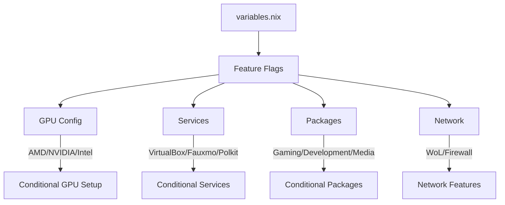

# 📚 NixOS Configuration Guide


> Guia completo para entender e customizar esta configuração NixOS com Feature Flags

## 📑 Índice

1. [Instalação](#-instalação)
2. [Como Funciona o Sistema](#-como-funciona-o-sistema)
3. [Estrutura de Arquivos](#-estrutura-de-arquivos)
4. [Sistema de Feature Flags](#-sistema-de-feature-flags)
5. [Pacotes Instalados](#-pacotes-instalados)
6. [Exemplos de Configuração](#-exemplos-de-configuração)
7. [Comandos Essenciais](#-comandos-essenciais)
8. [Customização Avançada](#-customização-avançada)

## 🚀 Instalação

### **Instalação Rápida**

```bash
# Clone o repositório
git clone https://github.com/JakeMartinezz/hyprland-nix.git ~/nixos
cd ~/nixos

# Torne o instalador executável e execute-o
chmod +x install.sh
./install.sh
```

### **🔧 Funcionalidades do Script de Instalação**

O instalador inteligente (`install.sh`) fornece uma experiência de configuração interativa abrangente:

#### **📊 Coleta de Configuração Interativa**
- **Configuração Passo a Passo**: Processo de configuração guiado com validação
- **Detecção de Hardware**: Detecção automática de componentes do sistema
- **Seleção de Serviços**: Escolha quais serviços ativar (VirtualBox, integração Alexa, etc.)
- **Categorias de Pacotes**: Selecione pacotes de gaming, desenvolvimento, mídia e desktop
- **Gerações de Rollback**: Configure quantas gerações do sistema manter (padrão: 2)
- **Verificações de Segurança**: Previne erros comuns de instalação com validação pré-voo
- **Validação em Tempo Real**: Validação de entrada com mensagens de erro úteis

#### **🎮 Detecção Inteligente de GPU**
- **Detecção Automática**: Identifica GPUs AMD, NVIDIA e Intel
- **Recomendações de Driver**: Sugere drivers apropriados para cada tipo de GPU
- **Configurações de Performance**: Configura definições ótimas para gaming e produtividade
- **Suporte Multi-GPU**: Gerencia configurações de gráficos híbridos

#### **💾 Gerenciamento Dinâmico de Discos**
```bash
Discos/partições adicionais detectados:

  [1] /dev/sdb1
      Tamanho: 931.5G
      Sistema de arquivos: ext4
      UUID: 12345678-abcd-4def-9012-3456789abcde
      Label: Externo

# Sugere automaticamente ponto de montagem: /mnt/externo
```

- **Auto-Detecção**: Escaneia discos e partições adicionais
- **Montagem Baseada em Label**: Sugere pontos de montagem baseados nas labels dos discos
- **Extração de UUID**: Extrai automaticamente UUIDs para montagem estável
- **Opções de Montagem**: Opções personalizáveis com padrões inteligentes (`defaults,x-gvfs-show`)

#### **📋 Sistema de Presets de Configuração**
```bash
📁 Configuração salva encontrada!

Detalhes da Configuração:
  Username: jake
  Hostname: martinez
  GPU Type: amd
  Laptop: false
  Bluetooth: false
  Gaming: true
  Development: true
  Media: true
  VirtualBox: true
  Fauxmo/Alexa: true
  Kanshi (Gerenciamento de Displays): true
  Gerações de Rollback: 2
  Atualizações Automáticas: true
  Tema GTK: gruvbox
  Tema de Ícones: gruvbox-plus-icons
  Discos Adicionais: 1 configurado
    • Disco Externo: /mnt/externo (ext4, 931.5G)
  Criado em: Wed Jul 23 14:32:45 -03 2025

Usar esta configuração? (Y/n):
```

- **Salvar Configurações Completas**: Armazena todas as configurações com codificação Base64
- **Reinstalação Rápida**: Pula o processo de configuração com presets salvos
- **Presets Portáveis**: Salvos no arquivo `preset.conf` para transferência fácil
- **Informações Detalhadas**: Mostra data de criação e detalhes completos da configuração

#### **🌐 Suporte Multilíngue**
- **Inglês/Português**: Tradução completa da interface
- **Padrões Culturais**: Padrões apropriados baseados na seleção de idioma
- **Mensagens Localizadas**: Todos os prompts e mensagens de erro respeitam a escolha do idioma
- **Detecção Inteligente**: Detecta automaticamente a localização do sistema para idioma padrão

#### **🔒 Recursos de Segurança da Instalação**

1. **Validação Pré-Instalação**
   - Verificação de requisitos do sistema (RAM, espaço em disco, arquitetura)
   - Verificação de dependências (ferramentas e pacotes necessários)
   - Validação de permissões (acesso sudo, permissões de escrita)
   - Verificações de ambiente de segurança (detecção de container, UEFI/BIOS, Secure Boot)
   - Verificação de conectividade de internet (cache NixOS, acesso GitHub)
   - Validação de entrada (verificação de formato username/hostname)
   - Verificação de dependências (ferramentas e pacotes necessários)
   - Validação de permissões (acesso sudo, permissões de escrita)

2. **Prévia da Configuração**
   ```bash
   ╔══════════════ PRÉVIA DA CONFIGURAÇÃO ══════════════════╗
   ║ Username: jake                                         ║
   ║ Hostname: martinez                                     ║
   ║ GPU: AMD (drivers serão instalados)                    ║
   ║ Serviços: VirtualBox, Fauxmo/Alexa                     ║
   ║ Pacotes: Gaming, Development, Media                    ║
   ║ Discos Adicionais: 1 disco configurado                ║
   ╚═══════════════════════════════════════════════════════╝
   
   Prosseguir com a instalação? (Y/n):
   ```

3. **Manuseio Seguro de Arquivos**
   - Backup opcional da configuração NixOS existente
   - Cópia seletiva de arquivos (exclui documentação, preserva hardware-configuration.nix)
   - Capacidade de rollback se a instalação falhar

### **💡 Fluxo do Processo de Instalação**

1. **🔍 Detecção do Sistema**
   - Identificação de componentes de hardware
   - Verificação de arquitetura e capacidades do sistema
   - Análise da configuração existente

2. **⚙️ Configuração Interativa**
   - Coleta de informações do usuário (username, hostname)
   - Seleção do tipo de GPU com detecção automática
   - Ativação/desativação de recursos (modo laptop, Bluetooth, etc.)
   - Configuração de serviços (VirtualBox, integração Alexa, etc.)

3. **💾 Configuração de Discos**
   - Detecção e análise de discos adicionais
   - Configuração de pontos de montagem com sugestões baseadas em labels
   - Configuração de opções de sistema de arquivos e parâmetros de montagem
   - Configuração de montagem estável baseada em UUID

4. **📋 Prévia da Configuração**
   - Revisão completa da configuração antes da instalação
   - Validação de todas as opções selecionadas
   - Prompt de confirmação com resumo detalhado

5. **🚀 Implantação Segura**
   - Backup opcional da configuração existente
   - Cópia seletiva de arquivos para `/etc/nixos`
   - Geração de arquivos de configuração com configurações do usuário
   - Opção de rebuild pós-instalação

### **🔧 Opções Avançadas de Instalação**

#### **Integração de Dotfiles**
- **Configuração Opcional**: Escolha baixar e configurar dotfiles
- **Integração GNU Stow**: Gerenciamento automático de symlinks
- **Seleção de Repositório**: Suporte para repositórios de dotfiles personalizados
- **Resolução de Conflitos**: Gerencia dotfiles existentes graciosamente

#### **URLs de Repositório Personalizadas**
- **Flexibilidade de Fonte**: Use forks ou repositórios personalizados
- **Seleção de Branch**: Escolha branches específicas para instalação
- **Instalação Local**: Suporte para cópias locais do repositório

#### **Gerenciamento de Presets**
```bash
# Salvar configuração atual como preset
./install.sh --save-preset "meu-setup-gaming"

# Carregar e usar preset específico
./install.sh --load-preset "meu-setup-gaming"

# Listar presets disponíveis
./install.sh --list-presets
```

### **🚨 Solução de Problemas da Instalação**

#### **Problemas Comuns**
- **Erros de Permissão**: Certifique-se de que o script tem permissões de execução (`chmod +x install.sh`)
- **Problemas de Detecção de Disco**: Execute com sudo se discos adicionais não forem detectados
- **Problemas de Rede**: Verifique a conexão com a internet para downloads de pacotes
- **Requisitos de Espaço**: Certifique-se de ter pelo menos 2GB de espaço livre em `/nix/store`

#### **Opções de Recuperação**
- **Rollback**: Use `nixos-rebuild --rollback` se o rebuild falhar
- **Configuração Manual**: Edite `/etc/nixos/variables.nix` diretamente se necessário
- **Reset de Hardware**: Regenere `hardware-configuration.nix` com `nixos-generate-config`

## 🔧 Como Funciona o Sistema

### **Filosofia Central: Feature Flags**

Esta configuração NixOS utiliza um sistema de **feature flags centralizados** que permite uma única configuração universal adaptável a qualquer hardware através de flags booleanos em `variables.nix`.



### **Fluxo de Carregamento**

1. **flake.nix** carrega `variables.nix` como fonte da verdade
2. **Overlays** são aplicados universalmente (zen-browser, pokemon-colorscripts)
3. **Modules** são importados condicionalmente baseados nas features
4. **Configurações** são aplicadas apenas quando necessárias

## 🏗️ Estrutura de Arquivos

### **Organização por Responsabilidade**

```
nixos/
├── config/
│   └── variables.nix              🎯 CONFIGURAÇÃO CENTRAL
├── lib/
│   └── fauxmo.nix                 📱 COMPONENTES REUTILIZÁVEIS
├── modules/
│   ├── home/                      👤 USUÁRIO
│   │   ├── custom-scripts.nix     🔧 Scripts (rebuild/clean/update)
│   │   ├── git.nix                📝 Configuração Git
│   │   ├── gtk.nix                🎨 Temas GTK
│   │   ├── hypr-workspace-manager.nix 🖥️ Gerenciamento de serviços baseado em monitores
│   │   ├── kanshi.nix             📺 Configuração de displays/monitores
│   │   └── zsh.nix                💻 Shell personalizado
│   ├── packages/
│   │   ├── home/                  📦 PACOTES USUÁRIO
│   │   │   ├── core.nix           🔧 Ferramentas essenciais
│   │   │   ├── development.nix    💻 Ambiente desenvolvimento
│   │   │   ├── gaming.nix         🎮 Aplicações gaming
│   │   │   ├── media.nix          🎵 Mídia e comunicação
│   │   │   └── desktop.nix        🖥️ Aplicações GUI
│   │   └── system/                📦 PACOTES SISTEMA
│   │       ├── core.nix           🔧 Ferramentas fundamentais
│   │       ├── desktop.nix        🖥️ Ambiente desktop
│   │       ├── gaming.nix         🎮 Componentes gaming
│   │       ├── media.nix          🎵 Componentes mídia
│   │       └── docker.nix         🐳 Containerização Docker
│   └── system/                    ⚙️ SISTEMA
│       ├── auto-update.nix        ⚙️ Atualizações automáticas
│       ├── bluetooth.nix          🟦 Configuração Bluetooth
│       ├── boot.nix               🚀 Boot (XanMod, Plymouth)
│       ├── conditional-services.nix 🔄 Serviços condicionais
│       ├── docker.nix             🐳 Containerização Docker
│       ├── filesystems.nix        💾 Discos e montagem
│       ├── fonts.nix              🔤 Fontes sistema
│       ├── gpu.nix                🎨 GPU (AMD/NVIDIA)
│       ├── pipewire.nix           🔊 Áudio PipeWire
│       ├── services.nix           🛠️ Serviços (GDM, power)
│       └── tz-locale.nix          🌍 Timezone/localização
├── flake.nix                      🌟 PONTO ENTRADA
├── configuration.nix              ⚙️ CONFIG PRINCIPAL
├── home.nix                       🏠 HOME MANAGER
└── hardware-configuration.nix     🔧 HARDWARE (auto)
```

## 🎛️ Sistema de Feature Flags

### **Estrutura do variables.nix**

```nix
{
  # === INFORMAÇÕES BÁSICAS ===
  username = "jake";
  hostname = "martinez";
  
  # === FEATURE FLAGS ===
  features = {
    # GPU Configuration
    gpu = {
      type = "amd";          # "amd" | "nvidia" | "intel"
      amd = {
        enable = true;
        sync = false;        # Multi-GPU sync
        optimizations = {    # Environment variables
          RADV_PERFTEST = "aco";
        };
      };
      nvidia = {
        enable = false;
        sync = true;
        intelBusId = "PCI:0:2:0";
        nvidiaBusId = "PCI:1:0:0";
        optimizations = {
          WLR_NO_HARDWARE_CURSORS = "1";
          NIXOS_OZONE_WL = "1";
          GBM_BACKEND = "nvidia-drm";
          __GLX_VENDOR_LIBRARY_NAME = "nvidia";
        };
      };
    };
    
    # Hardware Features
    bluetooth = {
      enable = false;        # Desktop geralmente não precisa
      powerOnBoot = false;
      packages = [ "bluez" "bluez-tools" "blueman" ];
    };
    
    laptop = {
      enable = false;        # Desktop mode
      packages = [ "wpa_supplicant" "hyprlock" ];
    };
    
    # Services and Integrations
    services = {
      fauxmo = {
        enable = true;       # Alexa integration
        ports = [ 52002 ];   # Firewall ports
      };
      
      virtualbox = {
        enable = true;       # VM support
      };
      
      docker = {
        enable = true;       # Docker containerization
        portainer = {
          enable = true;     # Docker web management UI
        };
      };
      
      polkit_gnome = {
        enable = true;       # GUI authentication
      };
    };
    
    # Network Features
    network = {
      wakeOnLan = {
        enable = true;
        interface = "enp3s0"; # Network interface
      };
    };
    
    # Package Groups
    packages = {
      gaming = {
        enable = true;       # Gaming applications
        system = [ "steam" "gamemode" ];
        home = [ "discord" "obs-studio" ];
      };
      
      development = {
        enable = true;       # Development tools
        languages = [ "nodejs" "python3" "rust" ];
        editors = [ "vscode" "claude-code" ];
      };
      
      media = {
        enable = true;       # Media applications
        players = [ "vlc" "spotify" ];
        editing = [ "gimp" "kdenlive" ];
      };
    };
  };
  
  # === PATHS E CONFIGURAÇÕES ===
  paths = {
    configPath = "/etc/nixos";
    backupBasePath = "/mnt/discos/utilitário/nix";
    backupConfigPath = "/mnt/discos/utilitário/nix/nixos/";
  };
  
  # === FILESYSTEMS ===
  filesystems = {
    drives = {
      main = {
        uuid = "a4f00c01-2048-4f65-9a01-deadbeef1234";
        mountPoint = "/mnt/discos/principal";
        fsType = "ext4";
      };
      
      storage = {
        uuid = "b5e11d02-3159-5e76-ab12-deadbeef5678";
        mountPoint = "/mnt/discos/armazenamento";
        fsType = "ext4";
      };
    };
  };
  
  # === BUILD E PERFORMANCE ===
  build = {
    maxJobs = "auto";      # Detecta automaticamente
    cores = 0;             # Usa todos cores (0 = auto)
    
    # Cache settings
    keepOutputs = true;
    keepDerivations = true;
    autoOptimiseStore = true;
  };
  
  # === SERVIÇOS SISTEMA ===
  services = {
    # Garbage collection
    gc = {
      automatic = true;
      dates = "weekly";
      options = "--delete-older-than 7d";
    };
    
    # OpenSSH
    openssh = {
      enable = true;
      permitRootLogin = "no";
      passwordAuthentication = false;
    };
  };
}
```

## 📦 Pacotes Instalados

### **Separação System vs Home**

#### **System Packages** (`environment.systemPackages`)
```nix
# modules/packages/system/core.nix
- wget, git, python3          # Ferramentas fundamentais
- pciutils, stow              # Utilitários sistema
- gnome-system-monitor        # Monitoramento
- polkit_gnome [conditional]  # Autenticação GUI

# modules/packages/system/desktop.nix
- hyprland, nautilus          # Ambiente desktop
- firefox, alacritty          # Aplicações básicas

# modules/packages/system/gaming.nix [conditional]
- steam, gamemode             # Gaming essencial
- wine, lutris                # Compatibilidade

# modules/packages/system/media.nix [conditional]
- pipewire, wireplumber       # Áudio sistema
- ffmpeg, gstreamer          # Codecs

# modules/system/docker.nix [conditional]
- docker, docker-compose      # Containerização
- docker-buildx               # Builds multi-plataforma
```

#### **Home Packages** (`home.packages`)
```nix
# modules/packages/home/core.nix
- htop, tree, unzip          # Utilitários usuário
- claude-code, cursor        # Ferramentas desenvolvimento

# modules/packages/home/development.nix [conditional]
- vscode, yarn, nodejs       # Desenvolvimento web
- docker-compose, kubectl    # DevOps
- postman, bruno             # API testing

# modules/packages/home/gaming.nix [conditional]
- discord, obs-studio        # Comunidade gaming
- mangohud, goverlay         # Monitoring gaming

# modules/packages/home/media.nix [conditional]
- spotify, vlc               # Reprodução mídia
- gimp, kdenlive            # Edição
- youtube-dl, yt-dlp        # Download mídia

# modules/packages/home/desktop.nix [conditional]
- telegram-desktop           # Comunicação
- libreoffice               # Produtividade
- flameshot                 # Screenshots
```

### **Overlays Disponíveis**
```nix
# flake.nix - Overlays centralizados
- zen-browser               # Browser otimizado
- pokemon-colorscripts      # Terminal colorido
- ags                      # Sistema widgets
```

## 💡 Exemplos de Configuração

### **Cenário 1: Desktop Gaming AMD**
```nix
# variables.nix
{
  features = {
    gpu = {
      type = "amd";
      amd.enable = true;
    };
    laptop.enable = false;
    bluetooth.enable = false;
    
    services = {
      virtualbox.enable = true;
      fauxmo.enable = true;
      docker.enable = true;
      polkit_gnome.enable = true;
    };
    
    packages = {
      gaming.enable = true;
      development.enable = true;
      media.enable = true;
    };
  };
}
```
**Resultado**: Sistema desktop com GPU AMD, VirtualBox, Docker, Alexa integration, pacotes gaming/dev/media.

### **Cenário 2: Laptop Work NVIDIA**
```nix
# variables.nix
{
  features = {
    gpu = {
      type = "nvidia";
      nvidia = {
        enable = true;
        sync = true;  # Para dual GPU
      };
    };
    laptop.enable = true;     # Ativa wpa_supplicant, hyprlock
    bluetooth.enable = true;  # Para periféricos
    
    services = {
      virtualbox.enable = false;  # Economiza recursos
      fauxmo.enable = false;      # Sem IoT
      docker.enable = true;       # Containers desenvolvimento
      polkit_gnome.enable = true;
    };
    
    packages = {
      gaming.enable = false;      # Foco trabalho
      development.enable = true;
      media.enable = false;       # Mídia básica apenas
    };
  };
}
```
**Resultado**: Laptop com NVIDIA, Bluetooth, Docker para desenvolvimento, sem gaming, otimizado para trabalho.

### **Cenário 3: Servidor Headless**
```nix
# variables.nix
{
  features = {
    gpu.type = "intel";  # iGPU básica
    laptop.enable = false;
    bluetooth.enable = false;
    
    services = {
      virtualbox.enable = true;   # Para VMs
      fauxmo.enable = false;
      docker.enable = true;       # Serviços containerizados
      polkit_gnome.enable = false; # Sem GUI
    };
    
    packages = {
      gaming.enable = false;
      development.enable = true;   # Ferramentas dev apenas
      media.enable = false;
    };
  };
  
  services = {
    openssh.enable = true;       # Acesso remoto
    gc = {
      automatic = true;
      dates = "daily";           # Limpeza agressiva
    };
  };
}
```
**Resultado**: Servidor com SSH, VMs, containers Docker, sem GUI, limpeza automática.

## ⚡ Comandos Essenciais

### **Scripts Customizados**
```bash
# Rebuild system
rebuild

# Update system
update

# Clean system + backup
clean

# Equivalentes manuais:
nixos-rebuild switch --flake /etc/nixos#default
nixos-rebuild switch --flake /etc/nixos#default --upgrade
nix-collect-garbage -d && nix-store --optimise
```


### **Gerenciamento de Serviços**
```bash
# Verificar serviços específicos
systemctl status fauxmo
systemctl status docker
systemctl status portainer
systemctl --user status polkit-gnome-authentication-agent-1

# Controle Fauxmo (automação baseada em monitores)
sudo systemctl start fauxmo    # Iniciar manual
sudo systemctl stop fauxmo     # Parar manual

# Gerenciamento Docker
sudo systemctl start docker    # Iniciar serviço Docker
sudo systemctl stop docker     # Parar serviço Docker
docker ps                      # Listar containers executando
docker system prune -af        # Limpar dados não utilizados Docker

# Logs de serviços
journalctl -u fauxmo -f
journalctl -u docker -f
journalctl -u portainer -f
journalctl --user -u polkit-gnome-authentication-agent-1 -f

# Monitorar status do sistema
hypr-workspace-manager status  # Verificar configuração monitores e serviços
```

## 🔧 Customização Avançada

### **Adicionando Nova Feature**

1. **Adicionar flag em variables.nix:**
```nix
features.services.meu_servico = {
  enable = false;
  port = 8080;
};
```

2. **Criar módulo condicional:**
```nix
# modules/system/conditional-services.nix
(lib.mkIf serviceFeatures.meu_servico.enable {
  services.meu_servico = {
    enable = true;
    port = serviceFeatures.meu_servico.port;
  };
})
```

3. **Adicionar pacotes se necessário:**
```nix
# modules/packages/system/core.nix
] ++ lib.optionals serviceFeatures.meu_servico.enable [
  meu_servico_package
```

### **Customizando GPU Config**

```nix
# variables.nix - Exemplo configuração específica
gpu = {
  type = "nvidia";
  nvidia = {
    enable = true;
    sync = false;                    # Single GPU
    intelBusId = "PCI:0:2:0";       # Bus ID específico
    nvidiaBusId = "PCI:1:0:0";
    optimizations = {
      # Variáveis ambiente específicas
      LIBVA_DRIVER_NAME = "nvidia";
      WLR_NO_HARDWARE_CURSORS = "1";
      NIXOS_OZONE_WL = "1";
      GBM_BACKEND = "nvidia-drm";
      __GLX_VENDOR_LIBRARY_NAME = "nvidia";
    };
  };
};
```

### **Filesystem Personalizado**

```nix
# variables.nix
filesystems = {
  drives = {
    dados = {
      uuid = "uuid-do-disco";
      mountPoint = "/mnt/dados";
      fsType = "btrfs";
      options = [ "compress=zstd" "noatime" ];
    };
    
    backup = {
      uuid = "uuid-backup";
      mountPoint = "/backup";
      fsType = "ext4";
      options = [ "noauto" "user" ];  # Mount manual
    };
  };
};
```

### **Pacotes Condicionais Complexos**

```nix
# modules/packages/home/development.nix
environment.systemPackages = with pkgs; [
  # Sempre instalados
  git
  python3
] ++ lib.optionals (devFeatures.languages ? nodejs) [
  # Só se nodejs estiver na lista
  nodejs
  yarn
  npm
] ++ lib.optionals (devFeatures.languages ? rust) [
  # Só se rust estiver na lista
  rustup
  rust-analyzer
] ++ lib.optionals devFeatures.docker.enable [
  # Só se docker habilitado
  docker
  docker-compose
];
```

## 🎯 Otimizações de Performance

### **Build Otimizado**
```nix
# variables.nix
build = {
  maxJobs = "auto";              # Usa todos cores disponíveis
  cores = 0;                     # Auto-detect
  keepOutputs = true;            # Cache build outputs
  keepDerivations = true;        # Cache derivations
  autoOptimiseStore = true;      # Deduplicação automática
};
```


### **Garbage Collection Inteligente**
```nix
# variables.nix
services.gc = {
  automatic = true;
  dates = "weekly";              # Ou "daily" para servidor
  options = "--delete-older-than 7d";
};
```

## 🚀 Próximos Passos

1. **Personalize variables.nix** com suas configurações
2. **Teste gradualmente** ativando features uma por vez
3. **Monitore logs** para identificar problemas
4. **Faça backups** antes de mudanças grandes
5. **Contribua** com melhorias para a configuração

---

Este guia cobre os aspectos fundamentais da configuração. Para dúvidas específicas, consulte o código-fonte dos módulos ou abra uma issue no repositório.

**Happy NixOS Configuration! 🎉**