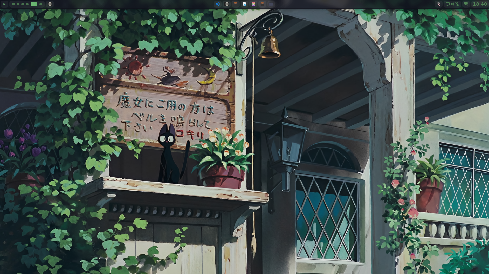

# NixOS Configuration




> Jake's NixOS Configuration with Hyprland

## 🏗️ Arquitetura e Design

Esta configuração NixOS foi projetada seguindo princípios de **modularização**, **separação de responsabilidades** e **centralização de variáveis**. A estrutura é baseada em camadas funcionais que se complementam.

### Filosofia de Design

- **📦 Modularização por Responsabilidade**: Cada módulo tem uma função específica
- **🎯 Separação System vs Home**: Distinção clara entre configurações do sistema e do usuário
- **🔄 Centralização de Configurações**: Valores hardcoded eliminados através de variáveis centralizadas
- **⚡ Otimização de Performance**: Build otimizado e cache inteligente
- **🔧 Escalabilidade Multi-Host**: Preparado para múltiplas máquinas

## 📁 Estrutura Detalhada do Projeto

```
nixos/
├── 🔧 config/                     # CAMADA DE CONFIGURAÇÃO
│   └── variables.nix              # Fonte única da verdade - feature flags centralizados
│
├── 📚 lib/                        # BIBLIOTECAS E COMPONENTES REUTILIZÁVEIS
│   └── fauxmo.nix                 # Integração com Alexa (IoT)
│
├── 🧩 modules/                    # CAMADA MODULAR PRINCIPAL
│   ├── 🏠 home/                   # Módulos do Home Manager (usuário)
│   │   ├── custom-scripts.nix     # Scripts personalizados (rebuild/clean/update)
│   │   ├── gaming-on-demand.nix   # Otimizações de gaming sob demanda
│   │   ├── git.nix                # Configuração do Git
│   │   ├── gtk.nix                # Temas GTK
│   │   └── zsh.nix                # Shell Zsh com prompt personalizado
│   │
│   ├── 📦 packages/               # CAMADA DE GERENCIAMENTO DE PACOTES
│   │   ├── home/                  # Pacotes do usuário (home.packages)
│   │   │   ├── core.nix           # Ferramentas essenciais do usuário
│   │   │   ├── development.nix    # Ambiente de desenvolvimento
│   │   │   ├── gaming.nix         # Aplicações de gaming
│   │   │   ├── media.nix          # Mídia e comunicação
│   │   │   └── desktop.nix        # Aplicações desktop/GUI
│   │   └── system/                # Pacotes do sistema (environment.systemPackages)
│   │       ├── core.nix           # Ferramentas fundamentais do sistema
│   │       ├── desktop.nix        # Ambiente desktop (Hyprland, Nautilus)
│   │       ├── gaming.nix         # Componentes de gaming do sistema
│   │       └── media.nix          # Componentes de mídia do sistema
│   │
│   └── ⚙️ system/                 # Módulos de configuração do sistema
│       ├── boot.nix               # Configuração de boot (XanMod, Plymouth)
│       ├── conditional-services.nix # Serviços condicionais (VirtualBox, Fauxmo, WoL)
│       ├── filesystems.nix        # Configuração centralizada de filesystems
│       ├── fonts.nix              # Fontes do sistema
│       ├── gpu.nix                # Configuração GPU (AMD/NVIDIA) com feature flags
│       ├── pipewire.nix           # Sistema de áudio PipeWire
│       ├── services.nix           # Serviços do sistema (GDM, power management)
│       └── tz-locale.nix          # Timezone e localização
│
├── 🌟 flake.nix                   # PONTO DE ENTRADA - configuração única universal
├── ⚙️ configuration.nix           # Configuração principal do sistema
├── 🏠 home.nix                    # Configuração principal do Home Manager
├── 🚀 install.sh                  # Instalador inteligente e interativo
├── ⚙️ variables.sh                # Configurações customizáveis do instalador
└── 📋 preset.conf                 # Configuração salva (gerado automaticamente)
```

## 🎯 Como as Camadas Interagem

### 1. **Camada de Configuração (`config/`)**
- **Propósito**: Fonte única da verdade para todas as variáveis
- **Design**: Estrutura hierárquica que separa configurações por escopo
- **Benefício**: Mudanças centralizadas, eliminação de hardcode

```nix
# Exemplo da estrutura de variables.nix
{
  username = "jake";          # Usado em configuration.nix e home.nix
  hostname = "martinez";      # Usado em configuration.nix
  filesystems.diskUUID = "...";  # Usado em modules/system/filesystems.nix
  paths.backupPath = "...";   # Usado em custom-scripts.nix
}
```

### 2. **Sistema de Feature Flags (`variables.nix`)**
- **Propósito**: Configuração universal adaptável via flags booleanos
- **Design**: Features ativadas/desativadas condicionalmente
- **Escalabilidade**: Combinações infinitas de recursos via flags

```nix
# config/variables.nix - Feature flags centralizados
{
  features = {
    gpu = {
      type = "amd"; # "amd" | "nvidia" | "intel"
      amd.enable = true;
    };
    laptop.enable = false; # Desktop mode
    
    # Configuração de Temas
    gtk = {
      theme = "gruvbox";              # "catppuccin" | "gruvbox" | "gruvbox-material"
      icon = "gruvbox-plus-icons";    # "tela-dracula" | "gruvbox-plus-icons"
    };
    
    services = {
      fauxmo = {
        enable = true;
        ports = [ 52002 ]; # Firewall configuration
      };
      polkit_gnome = {
        enable = true; # GNOME authentication agent
      };
      autoUpdate = {
        enable = false; # Atualizações automáticas semanais (desabilitado por padrão)
      };
    };
  };
}
```

### 3. **Camada Modular Principal (`modules/`)**

#### **3.1 Home Manager (`modules/home/`)**
- **Responsabilidade**: Configurações específicas do usuário
- **Escopo**: Dotfiles, aliases, scripts personalizados
- **Isolamento**: Separado das configurações do sistema

#### **3.2 Gerenciamento de Pacotes (`modules/packages/`)**
- **Design Inovador**: Separação entre `system/` e `home/`
- **Vantagem**: Evita conflitos entre pacotes do sistema e do usuário
- **Organização Temática**: Pacotes agrupados por função (core, development, gaming, media)

```nix
# Sistema vs Usuário - Exemplo prático
system/core.nix:     git, python3, wget           # Ferramentas fundamentais
home/development.nix: vscode, claude-code, yarn   # Ferramentas específicas do dev
```

#### **3.3 Sistema (`modules/system/`)**
- **Responsabilidade**: Configurações baixo nível do sistema
- **Modularização**: Cada aspecto do sistema em arquivo separado
- **Manutenibilidade**: Fácil debugging e modificação

## 🔄 Fluxo de Inicialização

```
1. flake.nix
   ├── Carrega variables.nix (feature flags centralizados)
   ├── Define overlays consolidados (zen, pokemon-colorscripts, ags)
   └── Constrói configuração universal "default"
       │
2. configuration.nix
   ├── Importa módulos condicionais (gpu.nix, conditional-services.nix)
   ├── Aplica feature flags de variables.nix
   └── Configura Nix settings (build otimizado)
       │
3. home.nix
   ├── Importa módulos home (zsh, git, packages/home/*)
   ├── Configura Home Manager com feature flags
   └── Aplica configurações condicionais do usuário
       │
4. modules/system/*.nix
   ├── gpu.nix: Configuração condicional AMD/NVIDIA
   ├── conditional-services.nix: VirtualBox, Fauxmo, WoL, Polkit GNOME
   ├── filesystems.nix: Discos e montagem centralizada
   └── Outros módulos do sistema
```

## ⚡ Otimizações Arquiteturais

### **Build Performance**
- **Parallel Builds**: Utiliza todos os 12 cores disponíveis
- **Cached Derivations**: `keep-outputs` e `keep-derivations` ativados
- **Overlay Consolidation**: Todos overlays centralizados no flake.nix

### **Modularização Inteligente**
- **Lazy Loading**: Módulos carregados apenas quando necessários
- **Separation of Concerns**: Cada módulo tem responsabilidade única
- **Dependency Management**: Dependências claramente definidas

### **Escalabilidade**
- **Multi-Systems Ready**: Fácil adição de novas features
- **Variable-Driven**: Configurações adaptáveis via variables.nix
- **Profile System**: Base para diferentes perfis (gaming, work, etc.)

## 🧠 Decisões de Design

### **Por que usar Feature Flags em vez de Hosts?**
- **Configuração Universal**: Uma única configuração se adapta a qualquer hardware
- **Escalabilidade**: Novos recursos ativados/desativados via variables.nix
- **Manutenibilidade**: Eliminação de duplicação de código entre hosts
- **Flexibilidade**: Combinações de features personalizadas por máquina

### **Por que centralizar overlays no flake.nix?**
- **Single Source of Truth**: Evita duplicação de overlays
- **Consistency**: Mesmos overlays aplicados em system e home
- **Maintainability**: Modificações em um lugar só

### **Por que usar variables.nix?**
- **DRY Principle**: Don't Repeat Yourself
- **Type Safety**: Nix verifica tipos automaticamente
- **Refactoring**: Mudanças em massa simplificadas

## 🎮 Recursos Específicos

### **Gaming on Demand**
```nix
# gaming-on-demand.nix - Sistema inteligente de otimização
gaming-mode-on  → Aplica sysctls de performance + CPU governor
gaming-mode-off → Restaura configurações padrão
```

### **Configuração Avançada de Gaming**
```nix
# Configurações aprimoradas do gamemode em nível de sistema
programs.gamemode = {
  enable = true;
  settings = {
    general = {
      renice = 10;              # Maior prioridade para jogos
      inhibit_screensaver = 1;  # Previne protetor de tela durante jogos
    };
  };
};
# Steam com camadas de compatibilidade Proton-GE
# Ferramentas Vulkan e utilitários de performance incluídos
```

### **Sistema de Temas Dinâmico**
```nix
# Seleção de Tema GTK - Troca dinâmica sem rebuilds
gtk = {
  theme = "gruvbox";              # "catppuccin" | "gruvbox" | "gruvbox-material"
  icon = "gruvbox-plus-icons";    # "tela-dracula" | "gruvbox-plus-icons"
};
# Cores de ícones aplicadas automaticamente (ícones gruvbox → pastas cinza)
# Temas instalados condicionalmente (apenas temas selecionados baixados)
```

### **Atualizações Automáticas do Sistema**
```nix
# Atualizações semanais opcionais com notificações
system.autoUpgrade = {
  enable = true;                  # Controlado via features.services.autoUpdate.enable
  flake = inputs.self.outPath;
  flags = [ "--update-input" "nixpkgs" "--commit-lock-file" ];
  dates = "weekly";
  allowReboot = false;            # Seguro: sem reinicializações automáticas
};
# Notificação 5 minutos antes das atualizações via libnotify
```

### **Scripts Customizados**
```bash
rebuild → nixos-rebuild switch --flake ${configPath}#default
update  → nixos-rebuild switch --flake ${configPath}#default --upgrade  
clean   → GC + optimization + backup para ${backupPath}
```

### **Autenticação Polkit**
```nix
# Polkit GNOME Authentication Agent
# Ativado via features.services.polkit_gnome.enable = true
# Serviço systemd user configurado automaticamente
# Permite autenticação gráfica para operações privilegiadas
```

### **Integração IoT**
```nix
# lib/fauxmo.nix - Bridge Alexa-NixOS
# Ativado via features.services.fauxmo.enable = true
# Firewall configurado automaticamente via features.services.fauxmo.ports
# IP detectado automaticamente na inicialização do serviço
```

## ⚙️ Sistema de Configuração Customizável (variables.sh)

Esta configuração inclui um sistema inovador de personalização através do arquivo `variables.sh`, que permite customizar o comportamento do instalador sem modificar o código principal.

### **🔧 Configurações Disponíveis**

O arquivo `variables.sh` permite personalizar:

```bash
# Repositórios e URLs
DOTFILES_REPO_URL="https://github.com/SeuUsuario/seu-repo"
DOTFILES_BRANCH="main"

# Paths do sistema
NIXOS_CONFIG_PATH="/etc/nixos"              # Diretório de configuração
MOUNT_POINT_PREFIX="/mnt"                   # Prefixo para pontos de montagem
BACKUP_DIR_PREFIX="/etc/nixos.backup"       # Diretório para backups

# Configurações padrão
DEFAULT_USERNAME="${USER:-jake}"            # Username padrão
DEFAULT_HOSTNAME="${HOSTNAME:-nixos}"       # Hostname padrão

# Configurações técnicas
DEFAULT_MOUNT_OPTIONS="defaults,x-gvfs-show"  # Opções de montagem
MIN_FREE_SPACE_MB=2048                         # Espaço mínimo necessário
NETWORK_TIMEOUT=30                             # Timeout para operações de rede
```

### **✨ Benefícios do Sistema**

- **🎯 Personalização Fácil**: Edite apenas um arquivo para customizar o instalador
- **🔄 Backward Compatibility**: Funciona com ou sem `variables.sh`
- **🛡️ Segurança**: Valores padrão garantem funcionamento mesmo sem customização
- **📦 Portabilidade**: Configurações separadas do código principal
- **🚀 Manutenibilidade**: Updates no instalador não afetam suas customizações

### **📝 Como Usar**

1. **Personalizar (Opcional)**: Edite o arquivo `variables.sh` com suas preferências
2. **Executar Instalador**: O script detecta automaticamente suas configurações
3. **Backup Automático**: Suas customizações são preservadas em updates

```bash
# Exemplo de uso
cp variables.sh variables.sh.backup  # Backup das suas configurações
# Editar variables.sh conforme necessário
./install.sh  # O instalador usa suas configurações automaticamente
```

## 🚀 Início Rápido

### **Usando o Instalador Inteligente**

```bash
# Clone o repositório
git clone https://github.com/JakeMartinezz/hyprland-nix.git ~/nixos
cd ~/nixos

# Torne o instalador executável e execute-o
chmod +x install.sh
./install.sh
```

O instalador fornece uma experiência de configuração interativa abrangente:

#### **🎯 Funcionalidades do Script de Instalação**

- **🔧 Detecção de Hardware**: Detecção automática de GPU (AMD/NVIDIA/Intel) com configuração adequada de drivers
- **💾 Gerenciamento Inteligente de Discos**: Detecta automaticamente discos adicionais e configura pontos de montagem
- **📋 Presets de Configuração**: Salve e reutilize configurações completas para reinstalações rápidas
- **🌐 Interface Multilíngue**: Suporte completo Inglês/Português com padrões inteligentes
- **🔒 Instalação Segura**: Visualize a configuração antes de aplicar, backup opcional da configuração existente
- **⚙️ Opções de Montagem**: Opções de montagem personalizáveis com padrões inteligentes (`defaults,x-gvfs-show`)

#### **💡 Processo de Instalação**

1. **Detecção do Sistema**: Detecta automaticamente sua configuração de hardware
2. **Configuração Interativa**: Escolha tipo de GPU, ative/desative recursos, configure serviços
3. **Configuração de Discos**: Detecte e configure dispositivos de armazenamento adicionais
4. **Visualização da Configuração**: Revise a configuração completa antes da instalação
5. **Implantação Segura**: Faça backup da configuração existente (opcional) e implante a nova configuração

#### **📁 Exemplo do Sistema de Presets**

```bash
📁 Configuração salva encontrada!

Detalhes da Configuração:
  Username: jake
  Hostname: martinez
  GPU Type: amd
  Laptop: false
  Bluetooth: false
  Gaming: true
  Development: true
  Media: true
  VirtualBox: true
  Fauxmo/Alexa: true
  Discos Adicionais: 1 configurado
    • Disco Externo: /mnt/externo (ext4, 931.5G)
  Criado em: Wed Jul 23 14:32:45 -03 2025

Usar esta configuração? (Y/n):
```

### **Configuração Manual**

```bash
# Personalize features em config/variables.nix
features = {
  gpu.type = "amd";        # ou "nvidia"/"intel"
  laptop.enable = false;   # true para laptop
  services.fauxmo.enable = true; # Integração Alexa
};

# Aplique a configuração
rebuild
```

## 🎛️ Funcionalidades do Instalador Inteligente

A configuração inclui um script instalador sofisticado (`install.sh`) com recursos avançados:

### **🔧 Configuração Interativa**
- **Detecção de GPU**: Seleção automática entre AMD, NVIDIA e Intel
- **Recursos de Hardware**: Configurações específicas para laptop, suporte Bluetooth
- **Seleção de Serviços**: VirtualBox, integração Alexa, pacotes gaming
- **Gerenciamento de Discos**: Detecção e configuração automática de discos adicionais

### **💾 Detecção Inteligente de Discos**
```bash
Discos/partições adicionais detectados:

  [1] /dev/sdb1
      Tamanho: 931.5G
      Sistema de arquivos: ext4
      UUID: 12345678-abcd-4def-9012-3456789abcde
      Label: Externo

# Sugere automaticamente ponto de montagem baseado na label: /mnt/externo
```

### **⚙️ Personalização das Opções de Montagem**
- **Padrões recomendados**: `defaults,x-gvfs-show` (exibe no gerenciador de arquivos)
- **Opções customizadas**: Otimizações de performance, compressão, mount por usuário
- **Parsing inteligente**: Converte entrada do usuário para formato array Nix apropriado

### **📁 Presets de Configuração**
O instalador inclui um poderoso sistema de presets:

```bash
📁 Configuração salva encontrada!

Configuração salva encontrada:
  Username: jake
  Hostname: martinez
  GPU Type: amd
  Laptop: false
  Bluetooth: false
  Gaming: true
  Development: true
  Media: true
  VirtualBox: true
  Fauxmo/Alexa: true
  Additional Disks: 1 configurado(s)
    Detalhes dos discos:
      • disco1:
        UUID: 12345678-abcd-4def-9012-3456789abcde
        Montagem: /mnt/externo
        Sistema: ext4
        Opções: "defaults" "x-gvfs-show"
  Configuração criada em: Wed Jul 23 14:32:45 -03 2025

Deseja usar esta configuração salva? (Y/n):
```

### **🌐 Suporte Multilíngue**
- **Inglês/Português**: Interface adapta automaticamente o idioma
- **UX Consistente**: Todas mensagens e prompts respeitam a escolha do idioma
- **Padrões inteligentes**: Defaults culturalmente apropriados por idioma

### **🔒 Processo de Instalação Seguro**
1. **Coleta de Configuração**: Reune todas as preferências do usuário primeiro
2. **Preview & Confirmação**: Mostra configuração completa antes de prosseguir
3. **Backup Seletivo**: Backup opcional da configuração NixOS existente
4. **Instalação Limpa**: Copia apenas arquivos essenciais, exclui documentação
5. **Preservação de Hardware**: Mantém o `hardware-configuration.nix` existente

### **📋 Gerenciamento de Presets**
- **Salvamento Automático**: Oferece salvar configuração para reuso futuro
- **Reuso Instantâneo**: Pula todo processo de configuração com presets salvos
- **Presets Portáveis**: Salvos no diretório do script (`preset.conf`)
- **Exibição Detalhada**: Mostra data de criação e configurações completas dos discos

Esta arquitetura foi projetada para ser **mantível**, **escalável** e **performática**, seguindo as melhores práticas da comunidade NixOS enquanto adiciona inovações específicas para um setup desktop otimizado.
